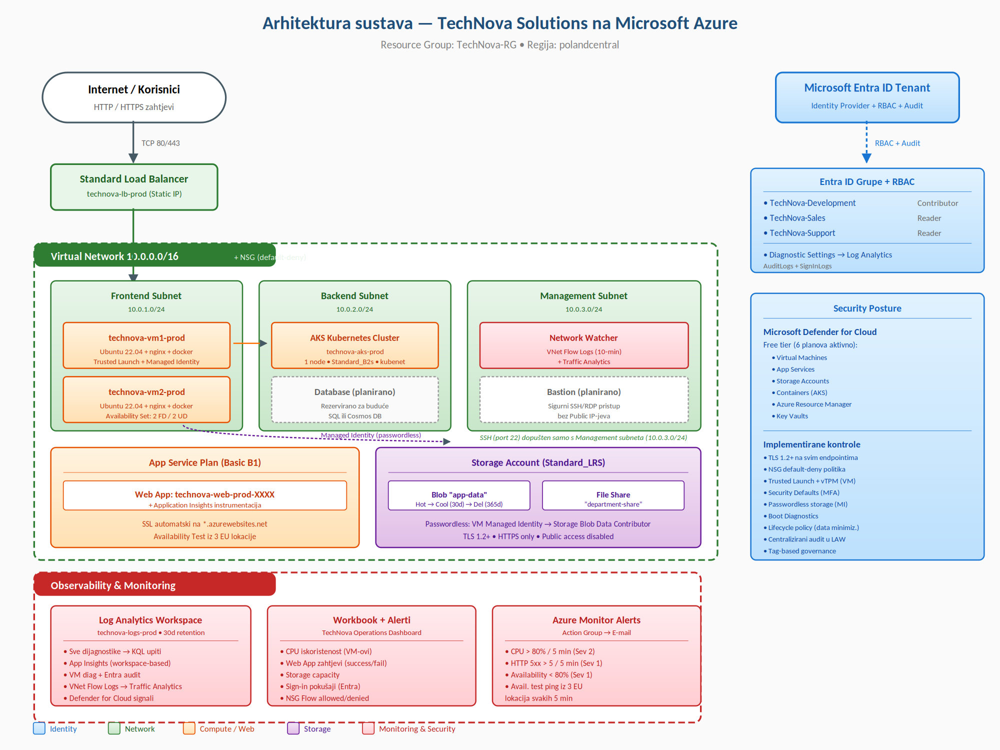

# TechNova Solutions — Azure Cloud migracija

Dobrodošli u repozitorij projekta za modernizaciju IT infrastrukture tvrtke TechNova Solutions. Rješenje demonstrira implementaciju **Infrastructure as Code (IaC)** principa koristeći **PowerShell** i **Azure CLI** za potpunu automatizaciju cloud okoline na Microsoft Azure platformi.

Projekt je izrađen u sklopu kolegija „Implementacija računarstva u oblaku" na Sveučilištu Algebra Bernays.

---

## Arhitektura rješenja

Rješenje je dizajnirano s naglaskom na sigurnost (*defense in depth*), automatizaciju (Infrastructure-as-Code) i visoku dostupnost (Availability Set + Standard Load Balancer + EU regija). Sve komponente kreiraju se jednim pokretanjem deploy skripte; cleanup skripta uklanja sve resurse uključujući tenant-level Entra ID grupe.



### Ključne komponente

| Komponenta | Tehnologija | Opis |
| --- | --- | --- |
| **Identiteti (IAM)** | **Microsoft Entra ID** | Tri grupe (Development, Sales, Support), RBAC dodjele po grupi, Security Defaults (MFA), Diagnostic Settings za audit |
| **Mreža** | **VNet + 3 Subneta + NSG** | Three-tier segmentacija (Frontend / Backend / Management), default-deny politika |
| **Load Balancing** | **Standard Load Balancer** | HTTP/HTTPS pravila + health probe, statički Public IP |
| **Compute (IaaS)** | **2× Virtual Machine** | Ubuntu 22.04 LTS, Standard_B1s, **Trusted Launch** + vTPM + Secure Boot, bez Public IP-a |
| **Visoka dostupnost** | **Availability Set** | 2 Fault Domains / 2 Update Domains (SLA 99.95 %) |
| **Kontejneri** | **Azure Kubernetes Service** | 1-node cluster (Standard_B2s), kubenet, System Assigned MI |
| **Web App (PaaS)** | **App Service Plan + Web App** | Basic B1 (Linux), Application Insights instrumentacija, Availability Test iz 3 EU lokacije |
| **Pohrana** | **Storage Account** | Standard_LRS, Blob `app-data` + Azure File Share `department-share`, Lifecycle Hot → Cool (30d) → Delete (365d) |
| **Identitet → Storage** | **Managed Identity** | Passwordless pristup (uloga *Storage Blob Data Contributor*) |
| **Monitoring** | **Log Analytics + App Insights** | Centralizirani log store, workspace-based App Insights, custom Workbook s 5 panela |
| **Mrežni nadzor** | **VNet Flow Logs + Traffic Analytics** | 10-min interval, kompletan VNet promet → Log Analytics |
| **Sigurnosna postura** | **Defender for Cloud (Free tier)** | 6 planova: VirtualMachines, AppServices, StorageAccounts, Containers, ARM, KeyVaults |
| **Alerti** | **Azure Monitor + Action Group** | CPU > 80 % × 2, HTTP 5xx > 5, Availability < 80 % → e-mail |
| **Governance** | **Resource tagovi** | Project / Env / Owner / CostCenter na svim resursima |
| **Automatizacija** | **PowerShell + Azure CLI** | Idempotentne skripte; potpuni *one-click* deploy i cleanup |

---

## Preduvjeti

### 1. Alati

- **PowerShell 7+** (preporučeno)
- **Azure CLI** 2.50+
- **Az PowerShell module**

### 2. Provjera i instalacija

Otvorite PowerShell i pokrenite:

```powershell
# Instalacija Az modula (ako već nije instaliran)
Install-Module -Name Az -Scope CurrentUser -Repository PSGallery -Force

# Provjera verzija
az --version
$PSVersionTable.PSVersion
Get-Module -ListAvailable Az.Accounts | Select-Object Version -First 1
```

### 3. Azure preduvjeti

- **Aktivna Azure pretplata** (Student, Free Trial ili Pay-As-You-Go)
- Minimalno **4 vCPU dostupne kvote** u odabranoj regiji (2× B1s + 1× B2s + buffer za AKS)
- Uloga **Owner** *ili* kombinacija **Contributor + User Access Administrator** na razini pretplate (potrebno za RBAC dodjele)
- Dozvole za kreiranje Entra ID grupa (default za većinu studentskih i razvojnih pretplata)

---

## ⚙️ Konfiguracija — što promijeniti prije pokretanja

Skripte sadrže nekoliko hardkodiranih vrijednosti koje **morate izmijeniti** prije pokretanja. Otvorite skripte u editoru (VS Code preporučen) i promijenite:

### 1. `Deploy-TechNova.ps1` (deploy skripta)

| Varijabla | Promijeniti u |
| --- | --- |
| `$subId` | **Vaš Azure Subscription ID** |
| `$alertEmail` | `"student@algebra.hr"` | **Vaša e-mail adresa** (za alert obavijesti) |

### 2. `Cleanup-TechNova.ps1` (cleanup skripta)

| Varijabla | Promijeniti u |
| --- | --- |
| `$subId` | **Isti Subscription ID** kao u deploy skripti |

### Opcionalno — regija

Default regija je `polandcentral`. Ako vaša pretplata nema dovoljnu kvotu u toj regiji, promijenite varijablu `$location` u obje skripte (npr. `westeurope`, `northeurope`, `swedencentral`).

```powershell
$location = "westeurope"   # ili druga regija s dostupnim B-serija VM kvotama
```

> **Napomena:** Resource Group naziv (`TechNova-RG`) i naming konvencija (`technova-<resurs>-prod`) ne smiju se mijenjati jer su definirani projektnim zadatkom.

### Kako pronaći Subscription ID

```powershell
# Login u Azure
Connect-AzAccount

# Prikaži dostupne pretplate
Get-AzSubscription | Format-Table Name, Id, TenantId
```

Kopirajte vrijednost iz stupca `Id`.

### Provjera vCPU kvote

Prije pokretanja, provjerite kvotu u odabranoj regiji:

1. Azure Portal → **Subscriptions** → odaberite svoju pretplatu
2. **Usage + quotas** → filtrirajte na *„Standard BS Family vCPUs"* za regiju
3. Potrebno: **minimalno 4 dostupne vCPU jedinice**

Skripta automatski provjerava kvotu na startu i upozorava ako nema dovoljno resursa.

---

## Upute za pokretanje

### Korak 1 — Preuzimanje repozitorija

```powershell
git clone https://github.com/<your-username>/technova-solutions.git
cd technova-solutions
```

### Korak 2 — Konfiguracija

Otvorite `Deploy-TechNova.ps1` u editoru i promijenite vrijednosti `$subId` i `$alertEmail` (vidi sekciju **Konfiguracija** iznad). Isto napravite za `Cleanup-TechNova.ps1` (samo `$subId`).

### Korak 3 — Login u Azure

```powershell
Connect-AzAccount
az login
```

Provjerite da ste prijavljeni u pravu pretplatu:

```powershell
Get-AzContext | Format-List Name, Subscription, Tenant
```

### Korak 4 — Pokretanje deploymenta

```powershell
./Deploy-TechNova.ps1
```

**Trajanje:** 15-20 minuta.

**Tijek po koracima (13 koraka):**

1. Provjera sesije + registracija Azure providera + Defender for Cloud Free tier
2. Resource Group `TechNova-RG` s globalnim tagovima
3. Entra ID grupe + RBAC dodjele (Contributor / Reader)
4. NSG + VNet s 3 subneta
5. Storage Account + Blob + File Share + Lifecycle policy
6. Standard Load Balancer + health probe
7. 2× VM s Trusted Launch + automatska instalacija nginx-a i docker-a
8. AKS cluster (1 node)
9. App Service Plan + Web App
10. Log Analytics Workspace + Application Insights + Diagnostic Settings (uključujući Entra ID audit/sign-in logove)
11. VNet Flow Logs + Traffic Analytics
12. Azure Monitor Workbook (5 panela za sve Ishode)
13. Action Group + 4 alerta + propagacija tagova

**Završetak:** Skripta ispisuje sažetak s URL-ovima, procjenom troška i lokacijom log datoteke (`~/TechNova-deploy-<timestamp>.log`).

---

## Verifikacija rješenja

### 1. Resource Group

Azure Portal → Resource Groups → **TechNova-RG**. Svi resursi moraju biti u stanju **Succeeded**.

### 2. Web aplikacija

URL Web App-a vidljiv je u izlazu skripte (`https://technova-web-prod-<rand>.azurewebsites.net`). Public IP Load Balancera vidi pod `technova-lb-ip`.

### 3. Microsoft Entra ID

Microsoft Entra ID → **Groups** → potvrdite postojanje:

- `TechNova-Development` (Contributor uloga)
- `TechNova-Sales` (Reader)
- `TechNova-Support` (Reader)

### 4. Provjera po Ishodima

| Ishod | Provjera u portalu |
| --- | --- |
| **1. Identity** | Entra ID → Groups; Resource Group → **Access Control (IAM)** → Role assignments |
| **2. Storage + Network** | Storage Account → Containers + **Lifecycle management**; VNet → Subnets |
| **3. Compute (VM + AKS)** | Resource Group → VM1, VM2, AKS resursi |
| **4. Network Security** | NSG inbound rules (4 pravila); Network Watcher → **VNet flow logs** (Status: Succeeded) |
| **5. Monitoring** | Monitor → **Workbooks** → *TechNova Operations Dashboard*; Monitor → **Alerts** (4 pravila) |

### 5. Workbook panele

Workbook KQL upiti zahtijevaju ingestiranu telemetriju. Nakon deploymenta pričekajte **15-30 minuta** prije nego što sve panele budu populirane. Generirajte malo prometa na Web App-u (otvorite URL nekoliko puta) i SSH-irajte se na VM kroz Serial Console kako bi se metrike pojavile.

---

## Sigurnosne napomene — ograničenja studentske pretplate

Sljedeće značajke **nisu implementirane skriptom** jer zahtijevaju premium licence izvan opsega Azure for Students pretplate. Sve su dokumentirane u PDF-u kao arhitekturne preporuke za produkcijsku implementaciju:

| Značajka | Razlog |
| --- | --- |
| **Conditional Access** (HR geo-block) | Zahtijeva AAD Premium P1 |
| **Privileged Identity Management (PIM)** | Zahtijeva AAD P2 |
| **Just-In-Time VM Access** | Zahtijeva Defender for Cloud Standard |
| **Auto-scale za App Service** | Zahtijeva Standard S1+ tier |
| **Application Gateway s WAF** | Izvan studentskog budžeta |

**MFA** je implementiran kroz **Security Defaults** (besplatno, bez AAD P1).

---

## Čišćenje

Nakon testiranja, pokrenite cleanup skriptu kako biste izbjegli daljnje troškove i oslobodili kvote:

```powershell
./Cleanup-TechNova.ps1
```

Skripta traži eksplicitnu potvrdu (`BRISI`) prije bilo kakvog brisanja. Briše:

- **Resource Group `TechNova-RG`** i sve resurse unutar (sinkrono, ~5-10 min)
- **AKS Managed Resource Group** (`MC_TechNova-RG_*`) eksplicitno (jer ostaje nakon AKS deletea)
- **VNet Flow Logs** (uz backward-compat za legacy NSG Flow Logs)
- **Entra ID Diagnostic Settings**
- **Entra ID grupe** (TechNova-Development, Sales, Support) — *tenant-level resursi koji se ne brišu s Resource Group-om*
- **NetworkWatcherRG** (uz multi-region safety check)
- **Lokalne log datoteke**

**Trajanje:** 5-10 min.

---

## Struktura projekta

```
.
├── README.md                           # Ova datoteka
├── Deploy-TechNova.ps1                 # Glavna deployment skripta (13 koraka)
├── Cleanup-TechNova.ps1                # Skripta za čišćenje okruženja
└── assets/
    └── architecture_diagram.png       # Visokorazinski arhitekturni dijagram
```
---

**Autor:** Marin Pavlović
**Institucija:** Sveučilište Algebra Bernays
**Kolegij:** Implementacija računarstva u oblaku
**Godina:** 2026.
